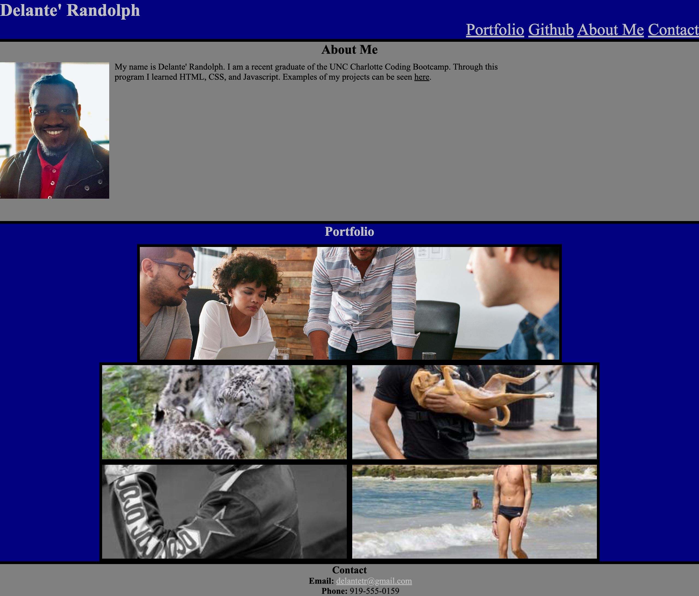

# fictional-engine
# <Challenge 2>

## Description

This code creates a basic portfolio for an employer to review. It contains a short bio along with a photo of the applicant, as well as various project that the applicant has completed. Each link in the nav bar takes you to a section of the page or a github repository. Contact inormation can be found at the bottom of the page in the footer.

## Usage

## License

MIT
---

